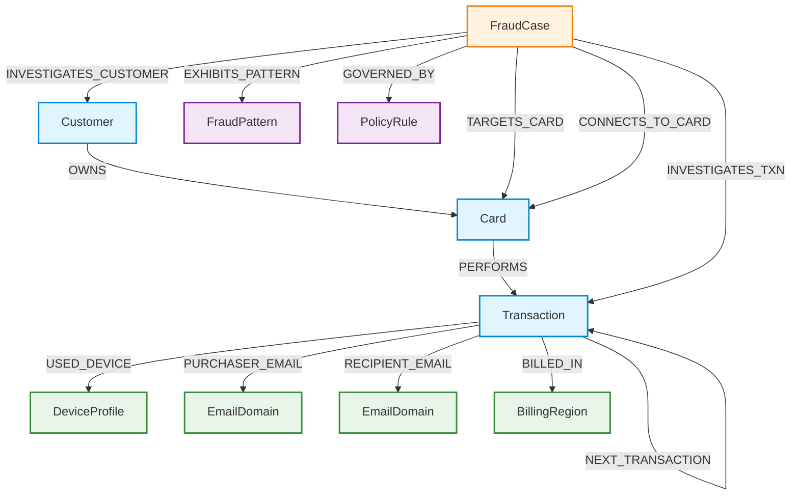

# HHGOA TigerGraph Schema
**Authoritative Graph Data Model & Schema Specification for Agentic Fraud Investigation**

---

## 1. Design Principles

The HHGOA TigerGraph schema is designed specifically to empower an autonomous AI fraud investigation agent operating on the IEEE-CIS dataset and the bank's operational fraud policies. Every vertex, edge, and attribute is derived directly from empirical dataset facts confirmed during the Phase 1 audit and the project specification (`README.md`).

### 1.1 Support for Fraud Investigation & Relationship Traversal
- **Entity Linking across Cards and Customers:** A customer can own multiple cards (`Customer -> OWNS -> Card`), and compromised credentials or syndicates frequently span multiple cards. Edge traversal enables the agent to instantly retrieve the full customer card portfolio and identify sibling cards sharing risk indicators.
- **Multi-Hop Syndicate & Ring Detection:** Attackers share digital infrastructure across disparate victim cards. By connecting transactions to `DeviceProfile`, `EmailDomain`, and `BillingRegion`, the graph turns disjoint transactions into a traversable network. A 2-hop query (`(:Card)-[:PERFORMS]->(:Transaction)-[:USED_DEVICE]->(:DeviceProfile)<-[:USED_DEVICE]-(:Transaction)<-[:PERFORMS]-(other:Card)`) reveals card rings and botnets operating across the bank in real time.
- **Bi-directional Traversal:** In TigerGraph, all directed edges are configured with explicit reverse edges (`WITH REVERSE_EDGE`). This allows the agent to navigate effortlessly from an entity (e.g. a suspicious device or high-risk billing region) backward to all associated transactions, cards, and cases.

### 1.2 Fraud-Pattern Detection
The schema natively surfaces the topological signatures of the five bank-recognized typologies (and undocumented variations):
1. **Card Testing (R5):** Enabled by the temporal `NEXT_TRANSACTION` sequence edge between transactions on a card. The agent traverses consecutive transactions ordered by timestamp `ts` to detect low-value rapid authorizations followed by high-value cash-outs without expensive full-table scans.
2. **Card-Not-Present (CNP) Fraud (R1-R4):** Identified by `Transaction.channel = "online"`, `ProductCD` in `{'C','R','H','S'}`, mismatched email domains, and anomalous amounts outside the cardholder baseline.
3. **CNP Fraud from New Device (R3):** Traversal to `DeviceProfile` with attribute `device_status = "New"` (derived from `identity.csv` column `id_15`) and proxy flags (`id_23`), highlighting unfamiliar endpoints.
4. **Out-of-Region Use (R2-R3):** Traversal to `BillingRegion` (`addr1`, `addr2`). The agent compares the transaction billing region against the customer's historical dominant region and checks for domestic (`addr2 == 87.0`) vs foreign jurisdiction.
5. **Account Takeover (ATO) (R10):** Multi-channel anomalies combining rapid online transactions via new devices, altered email domains (`P_emaildomain` / `R_emaildomain`), and match-flag divergences (`M1-M9`).
6. **Undocumented Patterns (R9):** Complex subgraphs (e.g. dense clusters sharing subtle proxy configurations, device hardware footprints, or foreign recipient domains) discovered via TigerGraph graph algorithms (Weakly Connected Components, Louvain, PageRank).

### 1.3 Evidence Retrieval & Case Memory
- **Unified Case Memory (`FraudCase`):** Historical cases (`closed_cases_history.csv`, 5,565 records) and active investigation cases (`case_pack.csv`, 20 exam targets) share a common vertex model. 
- **Historical Precedent Grounding:** 80% (16 of 20) of the case pack exam customers possess prior investigations in `closed_cases_history.csv`. Edge `INVESTIGATES_CUSTOMER` and `TARGETS_CARD` link new cases to prior cases, allowing the agent to recall prior disputes, false alarms, or confirmed compromises.
- **Dynamic Case Write-Back:** When the agent investigates a case, it writes findings, hypotheses, evidence subgraphs, SAR narratives, and recommended actions back into `FraudCase`. Future cases referencing the same device, card, or merchant automatically benefit from this accumulated institutional memory.

### 1.4 GraphRAG Integration
- **Hybrid Retrieval:** The graph combines structured topological neighborhood retrieval with unstructured semantic vector retrieval.
- **Textual Evidence Anchors:** Vertices store rich unstructured text: `FraudCase.analyst_notes`, `FraudCase.sar_narrative`, `FraudPattern.description`, and `PolicyRule.description`.
- **Knowledge Augmentation:** When the LLM evaluates a case, GraphRAG extracts:
  1. The 1-hop and 2-hop graph neighborhood (affected transactions, shared devices, shared regions).
  2. Semantically similar historical closed cases (`analyst_notes` embeddings).
  3. Authoritative policy rules (`PolicyRule`) and regulatory definitions (FinCEN SAR standards, FATF typologies).
  This eliminates hallucinations and grounds agent reasoning in verifiable facts.

### 1.5 Next-Best-Action Reasoning & Policy Enforcement
- **Deterministic Policy Vertices (`PolicyRule`):** Bank policies R1 through R10, approval routes (`auto`, `L1`, `L2`), and threshold constraints ($500 escalation, $1,000 SAR threshold, $2,500 L1/L2 approval boundary) are codified as graph entities.
- **Action Lineage:** Every recommended action (`initial_action`, `final_action`, `approval_route`) is connected to the exact `PolicyRule` that mandated it, ensuring auditability and compliance with banking regulations.

---

## 2. Vertex Schema

### 2.1 Summary Table

| Vertex | Primary Key | Attributes | Source | Purpose |
|---|---|---|---|---|
| `Customer` | `customer_id` (STRING) | `customer_id` (STRING) | `transactions.csv`, `case_pack.csv`, `closed_cases_history.csv` | Represents the human cardholder and relationship anchor across multiple cards and cases. |
| `Card` | `card_id` (STRING) | `card_id` (STRING), `network` (STRING), `card_type` (STRING), `issuer_code` (STRING) | `case_pack.csv`, `closed_cases_history.csv`, `transactions.csv` | Represents the payment card instrument; links customer to transactions and case actions. |
| `Transaction` | `transaction_id` (STRING) | `transaction_id` (STRING), `ts` (DATETIME), `amount` (FLOAT), `channel` (STRING), `product_cd` (STRING), `risk_score` (FLOAT), `dist1` (FLOAT), `dist2` (FLOAT), `is_flagged` (BOOL) | `transactions.csv`, `case_pack.csv` | The fundamental unit of financial activity; carries timestamps, amounts, channel, and model risk score. |
| `DeviceProfile` | `device_profile_id` (STRING) | `device_info` (STRING), `device_type` (STRING), `os` (STRING), `browser` (STRING), `screen_resolution` (STRING), `device_status` (STRING), `proxy_flag` (STRING), `match_status` (STRING) | `identity.csv` | Captures digital footprint and connection fingerprint for online transactions; detects shared attacker hardware. |
| `EmailDomain` | `domain_name` (STRING) | `domain_name` (STRING) | `transactions.csv` (`P_emaildomain`, `R_emaildomain`) | Represents email provider infrastructure; identifies disposable domains and shared syndicate routing. |
| `BillingRegion` | `region_id` (STRING) | `region_code` (STRING), `country_code` (STRING), `is_domestic` (BOOL) | `transactions.csv` (`addr1`, `addr2`) | Geographic billing anchor; enables detection of out-of-region card travel vs geographically impossible use. |
| `FraudCase` | `case_id` (STRING) | `case_id` (STRING), `status` (STRING), `trigger_type` (STRING), `trigger_text` (STRING), `opened_at` (DATETIME), `closed_at` (DATETIME), `outcome` (STRING), `pattern` (STRING), `exposure_usd` (FLOAT), `report_filed` (BOOL), `actions_taken` (STRING), `approval_route` (STRING), `analyst_notes` (STRING), `sar_narrative` (STRING) | `closed_cases_history.csv`, `case_pack.csv`, Agent runtime | Unified internal investigation record for both historical memory (5,565 closed cases) and active cases (20 case pack targets). |
| `FraudPattern` | `pattern_id` (STRING) | `pattern_name` (STRING), `description` (STRING), `typology_rules` (STRING) | `README.md`, `closed_cases_history.csv` | Knowledge vertex representing the 5 recognized fraud typologies plus undocumented/none. Grounding for GraphRAG. |
| `PolicyRule` | `rule_id` (STRING) | `rule_name` (STRING), `description` (STRING), `condition` (STRING), `prescribed_action` (STRING), `approval_route` (STRING) | `README.md` (Fraud Policy R1-R10) | Knowledge vertex representing bank operational policies, escalation triggers, and regulatory compliance rules. |

---

### 2.2 Detailed Entity Definitions

#### 1. `Customer`
- **Vertex Name:** `Customer`
- **Source File(s):** `transactions.csv`, `case_pack.csv`, `closed_cases_history.csv`
- **Source Column(s):** `customer_id`
- **Primary Key:** `customer_id` (STRING, e.g. `"C01234"`)
- **Attributes:**
  - `customer_id`: STRING (Non-null) — Unique customer identifier.
- **Purpose:** Central entity representing the customer/cardholder. Connects all cards held by the customer, establishing portfolio-level visibility to enforce Rule R10 ("Never BLOCK_ALL_CARDS unless at least two cards show confirmed fraud").
- **Evidence Supporting Existence:** 1,892 distinct customers confirmed in `transactions.csv` and `closed_cases_history.csv`; 20 exam customers in `case_pack.csv` all match `transactions.csv`.

#### 2. `Card`
- **Vertex Name:** `Card`
- **Source File(s):** `case_pack.csv`, `closed_cases_history.csv`, `transactions.csv`
- **Source Column(s):** `card_id`, `card1`, `card4`, `card6`
- **Primary Key:** `card_id` (STRING, e.g. `"C12382-K1"`)
- **Attributes:**
  - `card_id`: STRING (Non-null) — Identifier with customer prefix and card sequence suffix (`-K1`, `-K2`, `-K3`).
  - `network`: STRING (Nullable) — Card payment network from `card4` (`visa`, `mastercard`, `american express`, `discover`).
  - `card_type`: STRING (Nullable) — Card funding type from `card6` (`credit`, `debit`).
  - `issuer_code`: STRING (Nullable) — Issuer bank identifier code from `card1`.
- **Purpose:** Primary payment instrument subjected to compromise, testing, blocking, or reissuance.
- **Evidence Supporting Existence:** Explicitly cited in `case_pack.csv`, `closed_cases_history.csv` (`card_id`, `connected_card_ids`), and `README.md` ("Suggested graph schema: Customer -> OWNS -> Card").

#### 3. `Transaction`
- **Vertex Name:** `Transaction`
- **Source File(s):** `transactions.csv`, `case_pack.csv`, `closed_cases_history.csv`
- **Source Column(s):** `TransactionID`, `ts`, `TransactionAmt`, `channel`, `ProductCD`, `risk_score`, `dist1`, `dist2`
- **Primary Key:** `transaction_id` (STRING, e.g. `"3514030"`)
- **Attributes:**
  - `transaction_id`: STRING (Non-null) — Unique transaction identifier.
  - `ts`: DATETIME (Non-null) — Exact event timestamp between `2016-07-02` and `2016-12-31`.
  - `amount`: FLOAT (Non-null) — Transaction dollar amount in USD.
  - `channel`: STRING (Non-null) — Execution channel: `"in_person"` or `"online"`.
  - `product_cd`: STRING (Non-null) — Vesta product code (`W`, `C`, `H`, `R`, `S`).
  - `risk_score`: FLOAT (Non-null) — Bank detection model score `[0.0, 1.0]`.
  - `dist1`: FLOAT (Nullable) — Physical distance metric 1.
  - `dist2`: FLOAT (Nullable) — Physical distance metric 2.
  - `is_flagged`: BOOL (Non-null, Default `false`) — Whether transaction is an alert trigger in `case_pack.csv`.
- **Purpose:** Core financial event subject to risk scoring, dispute, tracing, temporal sequencing, and exposure aggregation.
- **Evidence Supporting Existence:** 590,742 transactions in `transactions.csv`; 20 flagged transactions in `case_pack.csv`; 14,955 transactions referenced in `closed_cases_history.csv`.

#### 4. `DeviceProfile`
- **Vertex Name:** `DeviceProfile`
- **Source File(s):** `identity.csv`
- **Source Column(s):** `DeviceInfo`, `DeviceType`, `id_30`, `id_31`, `id_33`, `id_15`, `id_23`, `id_34`
- **Primary Key:** `device_profile_id` (STRING — deterministic MD5/SHA256 hash or concatenated string of `DeviceInfo|id_30|id_31|id_33|DeviceType`)
- **Attributes:**
  - `device_profile_id`: STRING (Non-null) — Unique composite fingerprint.
  - `device_info`: STRING (Nullable) — Raw hardware/platform string (e.g. `"SAMSUNG SM-G935F Build/NRD90M"`).
  - `device_type`: STRING (Nullable) — Platform category (`"mobile"`, `"desktop"`).
  - `os`: STRING (Nullable) — Operating system from `id_30` (e.g. `"Android 7.0"`, `"iOS 11.1.2"`, `"Windows 10"`).
  - `browser`: STRING (Nullable) — Web browser from `id_31` (e.g. `"chrome 63.0"`, `"mobile safari 11.0"`).
  - `screen_resolution`: STRING (Nullable) — Screen dimensions from `id_33` (e.g. `"2220x1080"`).
  - `device_status`: STRING (Nullable) — Device familiarity flag from `id_15` (`"New"`, `"Found"`).
  - `proxy_flag`: STRING (Nullable) — Proxy status from `id_23` (`"IP_PROXY:ANONYMOUS"`, `"IP_PROXY:TRANSPARENT"`, `"IP_PROXY:HIDDEN"`).
  - `match_status`: STRING (Nullable) — Verification match flag from `id_34`.
- **Purpose:** Identifies shared attacker devices, emulators, and proxies operating across disparate cards (Rules R3, R6, Pattern 3, Pattern 5).
- **Evidence Supporting Existence:** 144,432 identity records in `identity.csv` joining on online transactions; explicitly recommended in `README.md` ("DeviceProfile (DeviceInfo + OS + browser + screen)").

#### 5. `EmailDomain`
- **Vertex Name:** `EmailDomain`
- **Source File(s):** `transactions.csv`
- **Source Column(s):** `P_emaildomain`, `R_emaildomain`
- **Primary Key:** `domain_name` (STRING, e.g. `"gmail.com"`, `"anonymous.com"`)
- **Attributes:**
  - `domain_name`: STRING (Non-null) — Domain name string.
- **Purpose:** Uncovers shared fraud infrastructure, anonymous email usage, and coordinated account takeover attacks.
- **Evidence Supporting Existence:** 59 distinct purchaser domains, 60 distinct recipient domains in `transactions.csv`; prescribed in `README.md` lines 171 and 177.

#### 6. `BillingRegion`
- **Vertex Name:** `BillingRegion`
- **Source File(s):** `transactions.csv`
- **Source Column(s):** `addr1`, `addr2`
- **Primary Key:** `region_id` (STRING, formatted as `"R_<addr1>"` or `"R_<addr1>_<addr2>"`, e.g. `"R_315_87"`)
- **Attributes:**
  - `region_id`: STRING (Non-null) — Geographic region composite identifier.
  - `region_code`: STRING (Nullable) — Anonymized billing region code from `addr1` (332 distinct codes).
  - `country_code`: STRING (Nullable) — Billing country code from `addr2` (`87.0` is domestic).
  - `is_domestic`: BOOL (Non-null) — True if `addr2 == '87.0'`, False if international.
- **Purpose:** Detects out-of-region spending anomalies (Pattern 4) and geo-clustering syndicates (Rule R6).
- **Evidence Supporting Existence:** Present on 525,027 transactions in `transactions.csv`; prescribed in `README.md` lines 43, 119, 171, and 178.

#### 7. `FraudCase`
- **Vertex Name:** `FraudCase`
- **Source File(s):** `closed_cases_history.csv`, `case_pack.csv`, Agent runtime
- **Source Column(s):** `case_id`, `customer_id`, `card_id`, `opened_at`, `closed_at`, `outcome`, `pattern`, `first_fraud_txn_id`, `txn_ids`, `n_txns`, `exposure_usd`, `actions_taken`, `report_filed`, `analyst_notes`, `trigger_type`, `trigger_text`, `risk_score`
- **Primary Key:** `case_id` (STRING, e.g. `"CC-0001"` for closed cases, `"HHG-001"` for active cases)
- **Attributes:**
  - `case_id`: STRING (Non-null) — Unique internal case identifier.
  - `status`: STRING (Non-null) — Lifecycle status (`"CLOSED"`, `"OPEN"`, `"UNDER_INVESTIGATION"`).
  - `trigger_type`: STRING (Nullable) — Trigger source: `"risk_score"`, `"customer_report"`, `"analyst_request"`.
  - `trigger_text`: STRING (Nullable) — Narrative describing why the alert fired.
  - `opened_at`: DATETIME (Non-null) — Case creation timestamp.
  - `closed_at`: DATETIME (Nullable) — Case resolution timestamp.
  - `outcome`: STRING (Nullable) — Investigation outcome: `"confirmed_fraud"`, `"cleared"`, `"uncertain"`.
  - `pattern`: STRING (Nullable) — Fraud pattern classification.
  - `exposure_usd`: FLOAT (Non-null, Default `0.0`) — Total fraud exposure in USD.
  - `report_filed`: BOOL (Non-null, Default `false`) — Whether regulatory SAR was filed.
  - `actions_taken`: STRING (Nullable) — Pipe-delimited list of actions executed/recommended.
  - `approval_route`: STRING (Nullable) — Prescribed approval route: `"auto"`, `"L1"`, `"L2"`.
  - `analyst_notes`: STRING (Nullable) — Full case investigation narrative / ground truth notes.
  - `sar_narrative`: STRING (Nullable) — Standalone regulatory SAR narrative when report is filed.
- **Purpose:** Primary repository of institutional memory. Stores 5,565 closed ground-truth cases and dynamically records the 20 active investigations as they progress.
- **Evidence Supporting Existence:** `closed_cases_history.csv` (5,565 rows), `case_pack.csv` (20 rows), and `README.md` Section 3a ("Write it into the graph too. That is your case memory").

#### 8. `FraudPattern`
- **Vertex Name:** `FraudPattern`
- **Source File(s):** `README.md` (Section "The five known fraud patterns"), `closed_cases_history.csv`
- **Source Column(s):** Derived knowledge entity (`pattern` column in `closed_cases_history.csv`)
- **Primary Key:** `pattern_id` (STRING, e.g. `"card_not_present_fraud"`, `"card_testing"`, `"account_takeover"`, `"card_not_present_new_device"`, `"out_of_region_use"`, `"none"`, `"undocumented"`)
- **Attributes:**
  - `pattern_id`: STRING (Non-null) — Standardized typology code.
  - `pattern_name`: STRING (Non-null) — Human-readable pattern title.
  - `description`: STRING (Non-null) — Authoritative description and red flags from bank manual.
  - `typology_rules`: STRING (Non-null) — Associated policy rule numbers (e.g. `"R5"`, `"R1,R2,R3,R4"`).
- **Purpose:** Knowledge graph anchor for GraphRAG reasoning. Ground-truth classifications link directly to this vertex, allowing the LLM to inspect formal definitions and retrieval prompts.
- **Evidence Supporting Existence:** The 5 documented patterns + undocumented + none account for 100% of all cases in `closed_cases_history.csv`.

#### 9. `PolicyRule`
- **Vertex Name:** `PolicyRule`
- **Source File(s):** `README.md` (Section "Fraud Policy", Rules R1 to R10)
- **Source Column(s):** Derived knowledge entity from official policy manual
- **Primary Key:** `rule_id` (STRING, e.g. `"R1"`, `"R2"`, `"R3"`, `"R4"`, `"R5"`, `"R6"`, `"R7"`, `"R8"`, `"R9"`, `"R10"`)
- **Attributes:**
  - `rule_id`: STRING (Non-null) — Rule identifier (`"R1"` to `"R10"`).
  - `rule_name`: STRING (Non-null) — Rule title (e.g. `"Card testing sequence"`, `"Shared origin"`).
  - `description`: STRING (Non-null) — Exact policy rule text.
  - `condition`: STRING (Non-null) — Logical triggers and probability thresholds (e.g. `"prob < 0.70"`, `"exposure > 1000"`).
  - `prescribed_action`: STRING (Non-null) — Mandatory actions (`"BLOCK_CARD"`, `"FILE_REPORT"`, etc.).
  - `approval_route`: STRING (Non-null) — Mandatory approval level (`"auto"`, `"L1"`, `"L2"`).
- **Purpose:** Codified bank policy governance. Enables Next-Best-Action selection and ensures rule compliance.
- **Evidence Supporting Existence:** Official Fraud Policy Version 1.0 defined in `README.md` lines 190–287.

---

### 2.3 Explicitly Rejected Entity Types & Audit Justification

In strict adherence to the instruction (*"Do NOT invent entities... Do not create a vertex merely because it appears in this prompt"*):

1. **`Account`:** **REJECTED.** In this dataset, accounts do not exist as a separate abstraction from `Customer` and `Card`. `customer_id` is directly derived from the card issuer field (`README.md` line 88: *"Derived from the card issuer field; one customer can have several cards"*). Creating an arbitrary `Account` vertex would introduce redundancy and join overhead without supporting data columns.
2. **`Merchant`:** **REJECTED.** Vesta anonymized all merchant entities into categorical product codes (`ProductCD`: `W`, `C`, `H`, `R`, `S`) and anonymous match flags (`M1` to `M9`). No merchant IDs, names, or merchant category codes (MCC) exist in `transactions.csv`. Inventing a `Merchant` vertex would violate the requirement against guessing/inventing fields.
3. **`Evidence` / `Action` as Standalone Disconnected Tables:** **REJECTED.** Evidence is naturally represented by the existing graph topology (the traversed Transactions, Devices, and Prior Cases linked to the Case) and recorded in the case file. Actions are tracked as attributes on `FraudCase` and `PolicyRule` rather than detached vertices.

---

## 3. Edge Schema

### 3.1 Summary Table

| Source | Edge | Target | Direction | Attributes | Source |
|---|---|---|---|---|---|
| `Customer` | `OWNS` | `Card` | Directed | `opened_date` (DATETIME) | `transactions.csv`, `case_pack.csv`, `closed_cases_history.csv` |
| `Card` | `PERFORMS` | `Transaction` | Directed | None | `transactions.csv`, `case_pack.csv`, `closed_cases_history.csv` |
| `Transaction` | `NEXT_TRANSACTION` | `Transaction` | Directed | `time_delta_sec` (INT), `amount_delta` (FLOAT) | `transactions.csv` (temporal ordering by `ts` per card) |
| `Transaction` | `USED_DEVICE` | `DeviceProfile` | Directed | `is_new_device` (BOOL) | `identity.csv` (joined on `TransactionID`) |
| `Transaction` | `PURCHASER_EMAIL` | `EmailDomain` | Directed | None | `transactions.csv` (`P_emaildomain`) |
| `Transaction` | `RECIPIENT_EMAIL` | `EmailDomain` | Directed | None | `transactions.csv` (`R_emaildomain`) |
| `Transaction` | `BILLED_IN` | `BillingRegion` | Directed | None | `transactions.csv` (`addr1`, `addr2`) |
| `FraudCase` | `INVESTIGATES_TXN` | `Transaction` | Directed | `is_flagged_trigger` (BOOL), `is_confirmed_fraud` (BOOL) | `case_pack.csv`, `closed_cases_history.csv` (`flagged_txn_id`, `first_fraud_txn_id`, `txn_ids`) |
| `FraudCase` | `TARGETS_CARD` | `Card` | Directed | None | `case_pack.csv`, `closed_cases_history.csv` (`card_id`) |
| `FraudCase` | `CONNECTS_TO_CARD` | `Card` | Directed | None | `closed_cases_history.csv` (`connected_card_ids`) |
| `FraudCase` | `INVESTIGATES_CUSTOMER`| `Customer` | Directed | None | `case_pack.csv`, `closed_cases_history.csv` (`customer_id`) |
| `FraudCase` | `EXHIBITS_PATTERN` | `FraudPattern` | Directed | None | `closed_cases_history.csv` (`pattern`), `README.md` |
| `FraudCase` | `GOVERNED_BY` | `PolicyRule` | Directed | `is_satisfied` (BOOL) | `README.md` (Fraud Policy R1-R10) |

*Note on Direction & Reverse Traversal:* In TigerGraph, all directed edges are declared with corresponding reverse edges (`WITH REVERSE_EDGE="<edge_name>_REVERSE"`), giving the investigation agent full bidirectional graph traversal capability.

---

### 3.2 Detailed Relationship Definitions

#### 1. `OWNS` (`Customer` -> `Card`)
- **Source Vertex:** `Customer`
- **Target Vertex:** `Card`
- **Direction:** Directed (Reverse: `OWNED_BY`)
- **Source Field:** `customer_id`
- **Target Field:** `card_id` (prefix matches `customer_id`)
- **Edge Attributes:** `opened_date` (DATETIME, Nullable)
- **Cardinality:** 1 to Many (1 customer owns 1 to 4 cards, typically `-K1`, `-K2`, `-K3`).
- **Dataset Evidence:** `case_pack.csv` and `closed_cases_history.csv` show cards named `<customer_id>-K<n>`. All 20 case pack cards match their customer IDs.
- **Investigation Utility:** Essential for portfolio-level impact analysis. When one card is compromised, the agent inspects sibling cards owned by the same customer to assess takeover risk or prevent unjustified blocking under Rule R10.

#### 2. `PERFORMS` (`Card` -> `Transaction`)
- **Source Vertex:** `Card`
- **Target Vertex:** `Transaction`
- **Direction:** Directed (Reverse: `PERFORMED_BY`)
- **Source Field:** Derived card identifier (from customer + card issuer columns)
- **Target Field:** `TransactionID`
- **Edge Attributes:** None
- **Cardinality:** 1 to Many.
- **Dataset Evidence:** `transactions.csv` transactions map to customers and card issuers; `closed_cases_history.csv` explicitly assigns `txn_ids` to `card_id`.
- **Investigation Utility:** Enables the agent to retrieve the cardholder's spending baseline, transaction volume, historical merchants, and normal spend distributions.

#### 3. `NEXT_TRANSACTION` (`Transaction` -> `Transaction`)
- **Source Vertex:** `Transaction`
- **Target Vertex:** `Transaction`
- **Direction:** Directed (Reverse: `PREV_TRANSACTION`)
- **Source Field:** `TransactionID` (at time $t$)
- **Target Field:** `TransactionID` (at time $t+1$ on same `Card`)
- **Edge Attributes:**
  - `time_delta_sec`: INT — Seconds elapsed between transactions.
  - `amount_delta`: FLOAT — Difference in transaction amounts.
- **Cardinality:** 1 to 1 chain per card.
- **Dataset Evidence:** Derived from `transactions.csv` by sorting transactions within each card by `ts` (`TransactionDT`).
- **Investigation Utility:** Directly detects **Card Testing (Pattern 1 / Rule R5)**: three rapid low-value transactions ($< $5) followed by a high-value purchase. Eliminates costly full-table window aggregations during graph traversal.

#### 4. `USED_DEVICE` (`Transaction` -> `DeviceProfile`)
- **Source Vertex:** `Transaction`
- **Target Vertex:** `DeviceProfile`
- **Direction:** Directed (Reverse: `USED_IN_TXN`)
- **Source Field:** `TransactionID`
- **Target Field:** `device_profile_id`
- **Edge Attributes:**
  - `is_new_device`: BOOL — True if `id_15 == "New"`.
- **Cardinality:** Many to 1 (online transactions only; 151,072 online transactions connect to 144,432 identity records).
- **Dataset Evidence:** `identity.csv` joins to `transactions.csv` on `TransactionID` for online product codes (`C`, `H`, `R`, `S`).
- **Investigation Utility:** Detects **Card-Not-Present New Device (Pattern 3)**, **Account Takeover (Pattern 5)**, and **Shared Origin Syndicate (Rule R6)**. When a device is shared across multiple unrelated cards, it immediately flags a coordinated fraud ring.

#### 5. `PURCHASER_EMAIL` (`Transaction` -> `EmailDomain`)
- **Source Vertex:** `Transaction`
- **Target Vertex:** `EmailDomain`
- **Direction:** Directed (Reverse: `PURCHASER_TXNS`)
- **Source Field:** `P_emaildomain`
- **Target Field:** `domain_name`
- **Edge Attributes:** None
- **Cardinality:** Many to 1.
- **Dataset Evidence:** Present on 590,742 transactions in `transactions.csv` (top: `gmail.com`, `yahoo.com`, `anonymous.com`).
- **Investigation Utility:** Distinguishes corporate vs disposable/anonymous email providers; detects email shifts indicating account credential compromise.

#### 6. `RECIPIENT_EMAIL` (`Transaction` -> `EmailDomain`)
- **Source Vertex:** `Transaction`
- **Target Vertex:** `EmailDomain`
- **Direction:** Directed (Reverse: `RECIPIENT_TXNS`)
- **Source Field:** `R_emaildomain`
- **Target Field:** `domain_name`
- **Edge Attributes:** None
- **Cardinality:** Many to 1 (online transactions where recipient email is collected).
- **Dataset Evidence:** 60 distinct recipient domains in `transactions.csv`.
- **Investigation Utility:** Enforces Rule R6 (*"shared origin... same recipient email in one window"*). Uncovers fraud rings channeling stolen funds to identical recipient domains across distinct victims.

#### 7. `BILLED_IN` (`Transaction` -> `BillingRegion`)
- **Source Vertex:** `Transaction`
- **Target Vertex:** `BillingRegion`
- **Direction:** Directed (Reverse: `BILLED_TXNS`)
- **Source Field:** `addr1`, `addr2`
- **Target Field:** `region_id`
- **Edge Attributes:** None
- **Cardinality:** Many to 1.
- **Dataset Evidence:** `addr1` (332 regions) and `addr2` (country codes) present in `transactions.csv`.
- **Investigation Utility:** Directly supports detection of **Out-of-Region Use (Pattern 4 / Rules R2, R3)**. Compares transaction region against the cardholder's habitual billing region. Distinguishes vacation travel (sustained multi-day use in one region) from card cloning (impossible simultaneous multi-region activity).

#### 8. `INVESTIGATES_TXN` (`FraudCase` -> `Transaction`)
- **Source Vertex:** `FraudCase`
- **Target Vertex:** `Transaction`
- **Direction:** Directed (Reverse: `INVOLVED_IN_CASE`)
- **Source Field:** `case_id`
- **Target Field:** `TransactionID`
- **Edge Attributes:**
  - `is_flagged_trigger`: BOOL — True if this transaction was the initial alert trigger.
  - `is_confirmed_fraud`: BOOL — True if confirmed fraudulent by analyst or agent verdict.
- **Cardinality:** 1 to Many.
- **Dataset Evidence:** `case_pack.csv` defines `flagged_txn_id` for all 20 cases; `closed_cases_history.csv` provides `first_fraud_txn_id` and pipe-separated `txn_ids` for all 5,565 closed cases.
- **Investigation Utility:** Connects cases to the disputed transactions, computes total dollar exposure under Section 4, and retrieves transaction context during investigation.

#### 9. `TARGETS_CARD` (`FraudCase` -> `Card`)
- **Source Vertex:** `FraudCase`
- **Target Vertex:** `Card`
- **Direction:** Directed (Reverse: `HAS_CASES`)
- **Source Field:** `card_id`
- **Target Field:** `card_id`
- **Edge Attributes:** None
- **Cardinality:** 1 to 1 (each case targets a specific primary card).
- **Dataset Evidence:** `case_pack.csv` and `closed_cases_history.csv` both contain an explicit `card_id` column.
- **Investigation Utility:** Connects the investigation to the affected card instrument to execute card-level actions (`BLOCK_CARD`, `MONITOR_CARD`, `STEP_UP_AUTH`).

#### 10. `CONNECTS_TO_CARD` (`FraudCase` -> `Card`)
- **Source Vertex:** `FraudCase`
- **Target Vertex:** `Card`
- **Direction:** Directed (Reverse: `CONNECTED_IN_CASES`)
- **Source Field:** `connected_card_ids`
- **Target Field:** `card_id`
- **Edge Attributes:** None
- **Cardinality:** 1 to Many.
- **Dataset Evidence:** `closed_cases_history.csv` contains `connected_card_ids` linking 24 cards across cases.
- **Investigation Utility:** Directly supports **Rule R6** and action `MONITOR_CONNECTED_CARDS`. When a case reveals ring activity, connected cards are immediately placed under heightened monitoring.

#### 11. `INVESTIGATES_CUSTOMER` (`FraudCase` -> `Customer`)
- **Source Vertex:** `FraudCase`
- **Target Vertex:** `Customer`
- **Direction:** Directed (Reverse: `CUSTOMER_CASES`)
- **Source Field:** `customer_id`
- **Target Field:** `customer_id`
- **Edge Attributes:** None
- **Cardinality:** 1 to 1.
- **Dataset Evidence:** `customer_id` column in both `case_pack.csv` and `closed_cases_history.csv`.
- **Investigation Utility:** Enables instant retrieval of customer case history. 16 of the 20 case pack customers have prior cases; traversing this edge provides immediate precedent.

#### 12. `EXHIBITS_PATTERN` (`FraudCase` -> `FraudPattern`)
- **Source Vertex:** `FraudCase`
- **Target Vertex:** `FraudPattern`
- **Direction:** Directed (Reverse: `CASES_WITH_PATTERN`)
- **Source Field:** `pattern`
- **Target Field:** `pattern_id`
- **Edge Attributes:** None
- **Cardinality:** Many to 1.
- **Dataset Evidence:** `closed_cases_history.csv` maps every case to one of the 7 pattern categories.
- **Investigation Utility:** Grounds the investigation in recognized typologies, supplies typology-specific evidence requirements to the agent, and powers GraphRAG pattern retrieval.

#### 13. `GOVERNED_BY` (`FraudCase` -> `PolicyRule`)
- **Source Vertex:** `FraudCase`
- **Target Vertex:** `PolicyRule`
- **Direction:** Directed (Reverse: `ENFORCING_CASES`)
- **Source Field:** Derived policy rule applied during investigation
- **Target Field:** `rule_id`
- **Edge Attributes:**
  - `is_satisfied`: BOOL — Whether the rule condition was met.
  - `mandated_action`: STRING — Prescribed action under this rule.
- **Cardinality:** Many to Many.
- **Dataset Evidence:** Policy Rules R1 through R10 from `README.md`.
- **Investigation Utility:** Provides verifiable compliance lineage for next-best-action reasoning, demonstrating why an action (`BLOCK_CARD`, `FILE_REPORT`, `ESCALATE_TO_ANALYST`) was mandated.

---

## 4. Entity Relationship Diagram



---

## 5. TigerGraph GSQL Schema Definition

Below is the production-ready TigerGraph GSQL DDL script implementing this exact schema:

```gsql
// ========================================================
// HHGOA Fraud Investigation Graph Schema
// Graph: HHGOA_Fraud_Graph
// ========================================================

CREATE GRAPH HHGOA_Fraud_Graph()

// 1. VERTEX DEFINITIONS
CREATE VERTEX Customer (
    PRIMARY_KEY customer_id STRING
) WITH STATS="OUTDEGREE_BY_EDGETYPE";

CREATE VERTEX Card (
    PRIMARY_KEY card_id STRING,
    network STRING,
    card_type STRING,
    issuer_code STRING
) WITH STATS="OUTDEGREE_BY_EDGETYPE";

CREATE VERTEX Transaction (
    PRIMARY_KEY transaction_id STRING,
    ts DATETIME,
    amount FLOAT,
    channel STRING,
    product_cd STRING,
    risk_score FLOAT,
    dist1 FLOAT,
    dist2 FLOAT,
    is_flagged BOOL DEFAULT false
) WITH STATS="OUTDEGREE_BY_EDGETYPE";

CREATE VERTEX DeviceProfile (
    PRIMARY_KEY device_profile_id STRING,
    device_info STRING,
    device_type STRING,
    os STRING,
    browser STRING,
    screen_resolution STRING,
    device_status STRING,
    proxy_flag STRING,
    match_status STRING
) WITH STATS="OUTDEGREE_BY_EDGETYPE";

CREATE VERTEX EmailDomain (
    PRIMARY_KEY domain_name STRING
) WITH STATS="OUTDEGREE_BY_EDGETYPE";

CREATE VERTEX BillingRegion (
    PRIMARY_KEY region_id STRING,
    region_code STRING,
    country_code STRING,
    is_domestic BOOL DEFAULT true
) WITH STATS="OUTDEGREE_BY_EDGETYPE";

CREATE VERTEX FraudCase (
    PRIMARY_KEY case_id STRING,
    status STRING,
    trigger_type STRING,
    trigger_text STRING,
    opened_at DATETIME,
    closed_at DATETIME,
    outcome STRING,
    pattern STRING,
    exposure_usd FLOAT DEFAULT 0.0,
    report_filed BOOL DEFAULT false,
    actions_taken STRING,
    approval_route STRING,
    analyst_notes STRING,
    sar_narrative STRING
) WITH STATS="OUTDEGREE_BY_EDGETYPE";

CREATE VERTEX FraudPattern (
    PRIMARY_KEY pattern_id STRING,
    pattern_name STRING,
    description STRING,
    typology_rules STRING
) WITH STATS="OUTDEGREE_BY_EDGETYPE";

CREATE VERTEX PolicyRule (
    PRIMARY_KEY rule_id STRING,
    rule_name STRING,
    description STRING,
    condition STRING,
    prescribed_action STRING,
    approval_route STRING
) WITH STATS="OUTDEGREE_BY_EDGETYPE";

// 2. EDGE DEFINITIONS (WITH BI-DIRECTIONAL REVERSE EDGES)
CREATE DIRECTED EDGE OWNS (FROM Customer, TO Card, opened_date DATETIME) WITH REVERSE_EDGE="OWNED_BY";
CREATE DIRECTED EDGE PERFORMS (FROM Card, TO Transaction) WITH REVERSE_EDGE="PERFORMED_BY";
CREATE DIRECTED EDGE NEXT_TRANSACTION (FROM Transaction, TO Transaction, time_delta_sec INT, amount_delta FLOAT) WITH REVERSE_EDGE="PREV_TRANSACTION";

CREATE DIRECTED EDGE USED_DEVICE (FROM Transaction, TO DeviceProfile, is_new_device BOOL) WITH REVERSE_EDGE="USED_IN_TXN";
CREATE DIRECTED EDGE PURCHASER_EMAIL (FROM Transaction, TO EmailDomain) WITH REVERSE_EDGE="PURCHASER_TXNS";
CREATE DIRECTED EDGE RECIPIENT_EMAIL (FROM Transaction, TO EmailDomain) WITH REVERSE_EDGE="RECIPIENT_TXNS";
CREATE DIRECTED EDGE BILLED_IN (FROM Transaction, TO BillingRegion) WITH REVERSE_EDGE="BILLED_TXNS";

CREATE DIRECTED EDGE INVESTIGATES_TXN (FROM FraudCase, TO Transaction, is_flagged_trigger BOOL, is_confirmed_fraud BOOL) WITH REVERSE_EDGE="INVOLVED_IN_CASE";
CREATE DIRECTED EDGE TARGETS_CARD (FROM FraudCase, TO Card) WITH REVERSE_EDGE="HAS_CASES";
CREATE DIRECTED EDGE CONNECTS_TO_CARD (FROM FraudCase, TO Card) WITH REVERSE_EDGE="CONNECTED_IN_CASES";
CREATE DIRECTED EDGE INVESTIGATES_CUSTOMER (FROM FraudCase, TO Customer) WITH REVERSE_EDGE="CUSTOMER_CASES";

CREATE DIRECTED EDGE EXHIBITS_PATTERN (FROM FraudCase, TO FraudPattern) WITH REVERSE_EDGE="CASES_WITH_PATTERN";
CREATE DIRECTED EDGE GOVERNED_BY (FROM FraudCase, TO PolicyRule, is_satisfied BOOL, mandated_action STRING) WITH REVERSE_EDGE="ENFORCING_CASES";
```
